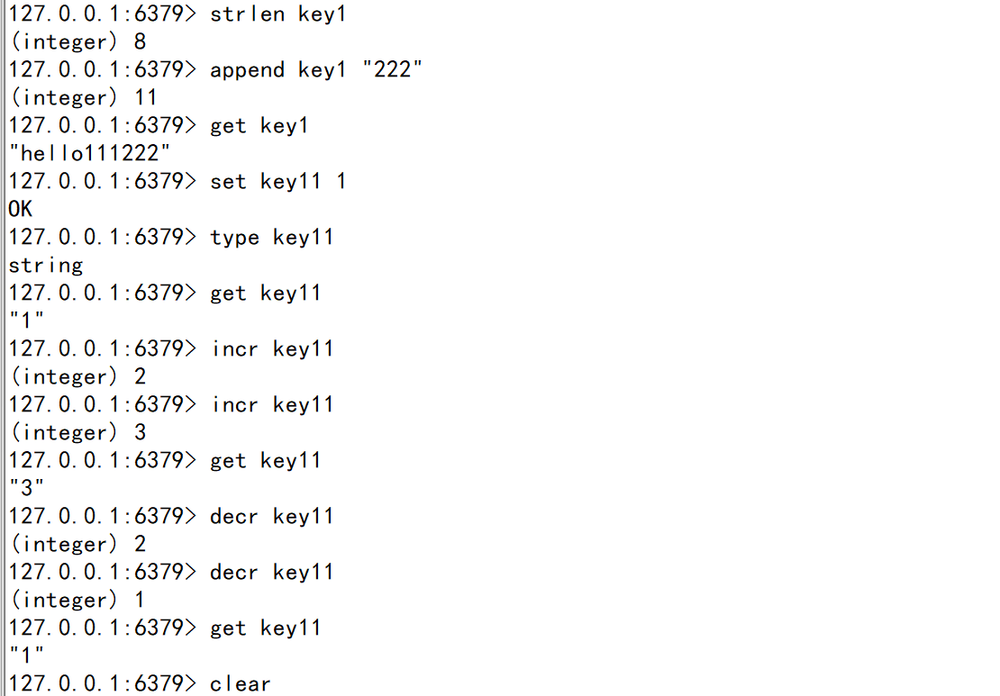
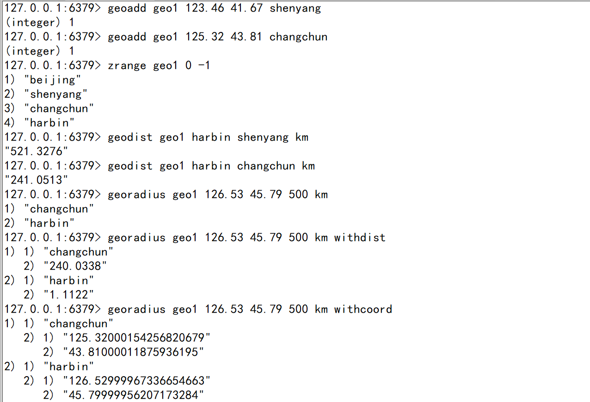
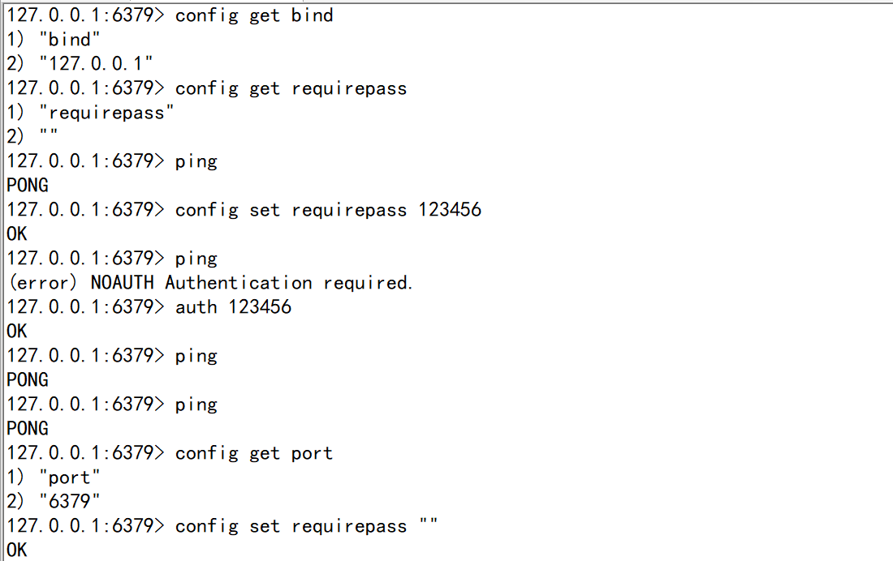

# Redis学习笔记

## Part 1  Mysql VS Nosql

时间戳   当前距离1970年1月1日8时0分0秒   的总秒数    计算机纪元

1971年   贝尔实验室的程序员 发明了unix系统和c语言 (jvm底层语言)
计算机都是32位的    时间跨度支持68年上下      1901—2038年范围内
随着64位系统的诞生   问题就解决了    2900多亿年

关系型数据库    E-R模型 (公司成员系统)

示例：

| 名字   | 所在部门 | 职位   | 特征 |
| ------ | -------- | ------ | ---- |
| 阿拓   | 教学部   | 老师   | 老   |
| 爱德华 | 清洁部   | 扫地僧 |      |

设计：表members

| 字段名     | 类型（大小） | 备注 |
| ---------- | ------------ | ---- |
| name       | varchar(255) | 名字 |
| department | varchar      | 部门 |
| title      | varchar      | 职位 |

非关系型数据库 (json类型)

行1  ： {“name”:"爱德华"，“department”:"清洁部"，“title”:"扫地僧"}

行2 ：  {“name”:"阿拓"，“department”:"教学部"，“title”:"老师"，“特征”：“老”}

## Part 2  Redis入门

Redis : REmote  DIctionary  Server 远程字典服务

RDS:  Relational  Database  Service 关系型数据服务

#### **一、linux命令**

1）ifconfig 查看ip地址，查找inet后面对应的ip地址 
           是secureCRT客户端 连接虚拟机地址使用的

2）ll 查看当前目录下的所有文件

3）cd  = change directory 进入指定目录
           cd ~ 返回初始目录
           cd  redis-5.0.6  是redis的安装包目录

4）vim  redis.conf 是打开当前的文件
           可以通过上下键移动光标
           输入:q 退出打开的状态   回到文件显示的窗口

#### **二、redis命令**

##### redis启动相关命令

1） redis-server  启动服务端的命令，但是需要保持当前窗口状态。
               打开新的窗口，使用clone session方法。

2） redis-cli -p 6379   启动客户端的命令，需要通过参数-p 指定端口号
               输入ping   会返回pong 代表连接ok 

3） set key1 "hello world"   设置key1的值为“hello world”  返回ok。

4） get key1   返回“hello world” ,说明数据可以正常的存取。

5） exit  退出当前的连接

6） shutdown  关闭当前的服务  然后再执行一次exit完全退出

7） redis-benchmark  压测命令
              测试在不同命令下  10w次请求在多长时间内完成
              官方标准是达到10w/s 的get/set

##### redis数据库相关命令

1） keys * 查看当前数据库所有的key值
                    系统会设置3个默认key额外使用

2） keys ?  匹配方式的使用
                对于存在key1 key2 key3形式的key时
                keys  key?   可以找到
                keys  k???    也可以找到     
                说明？是一个匹配符，并且有占位的作用

3） select 1 切换到1号数据库
              get  key1  返回nil，空的意思
              通过127.0.0.1:6379[?]后面的括号中的值，可以判断当前所在的数据库编号

4） dbsize  展示数据库中key的个数

5） flushdb  删除当前数据库的数据   "慎用!"     

6） flushall  删除所有数据库的数据   要怎么用   看着办      

​              get  key1  返回nil，空的意思

如图：

##### **redis键值操作命令**

1） exists  + key  判断键值是否存在

2） type  + key  显示当前键值存储的数据类型

3)   expire  + key  +  n   设置key值的有效时间为n秒 ,   过了有效期，此key的值置为空
                pexpire + key +  n   有效时间的单位变为毫秒。

4） ttl + key  还剩多长时间有效， 正数代表未过期的剩余时间，单位是秒。 
           pttl + key     返回剩余时间的单位变为毫秒。
           负数的情况如下：
               当返回-2时，说明key已经不存在
               当返回-1时，说明key没有设置有效时间。

5） persist  + key  设置数据一直有效，特别作用于错误设置了有效期之后。

6）del + key  删除一个key

7)   rename +  key + newKey   可以重命名key的值

8）randomkey  随机出一个key

9） move key +  dbID    移动指定key到另一个数据库中，dbID是数据库编号
            eg:  move key5 1

如图：

**redis配置：**

1） databases 16   
         默认是16个数据库，标号是0-15，默认进入的是0号数据库，可以通过select切换不同的库。

## Part 3  Redis数据类型

#### **一、String（字符串）**

1 命令：

1）strlen   查看字符串的长度
2）append   增加后缀，返回字符串的长度
            eg： append  key1 "222"   ->  "hello111222"
            eg:    set key1 "hello111222"
3） 当value的值是整数时，可以通过命令直接进行数学运算
         incr  自增 ，返回最新的值。
         decr  自减， 也返回最新的值。 
         incrby  增加，区别是增加计算的参数   如：incrby  key11 3。
         decrby 减少，同上。

4） 范围内操作的命令
        getrange  key  start  end 获取从初始位置到结束位置的值，从0计数  ==》 类似subString
        setrange  key  start  newStr  设置从起始位置开始，替换指定位置为新的字符串
                 eg :  "hello111222" ->  setrange key1  5 333 ->  "hello333222"

5)   整合命令
         setex   = set + expire      使用方式： setex + key + 时间 + value
         setnx   = set + exists   = set if not exists    使用方式：  setnx +  key  + value
                     如果key不存在，则设置数据，返回1。如果存在，不设置，返回0。
         getset  先取出原来的值，再设置为新值   使用方式:  getset + key + value   返回旧值。

6） 批量操作
         mget  = more  get   使用方式 : mget + key1 + key2 + key3
                      参数接收多个key， 结果返回多个value
         mset  = more set  使用方式：mset + key1 + value1 + key2 + value2
                      一次设置多个key和value， 参数本身是个map
         msetnx   使用方式同上。

如图：

2 原理：

redis的字符串是动态字符串，内部结构类似ArrayList。采用预分配冗余空间的方式减少内存的频繁分配。内部为字符串分配的实际空间一般高于字符串长度，当字符串长度<1MB时，扩容方式是直接加倍，如果>1MB，一次扩容只扩1MB，直到扩大到512MB。

#### **二、list（列表）**

栈和队列   -》  “数据结构”
栈： 像生活中的口袋一样，后进先出。  push 压栈   pop 弹出
队列：像生活中的排队一样，先进先出。

1 命令：

1）存取操作  push  pop   range
         lpush :   从左侧存入数据  —》  栈结构     弹出时执行lpop (从左侧弹出)
         rpush:   从右侧存入数据  —》  队列结构     弹出时执行lpop (从左侧弹出)
         lrange:   范围内查看数据    使用方式：lrange key start  end

2）对list本身的操作 
           llen   查看长度
           lindex  获取某一个位置的值，下角标从0开始
           lrem    删除n个value的值    使用方式： lrem key  N  value
           ltrim   截取某个范围的数据重新赋值给key   使用方式： ltrim key start  end (下角标从0开始)
           linsert   插入数据到某个位置的前后   
                    使用方式： linsert  key  before/after  oldValue  newValue
                    如果要插入数据到头部，还可以使用 lpushx， 使用方式：lpushx  key value
                    同理，如果要插入数据到尾部，可以使用 rpushx, 使用方式同上。
           lset   可以更改指定位置的值   使用方式： lset key  index  value

#### **三、Hash（哈希）**

HashMap<String,String>  ==》  string

HashMap<String,List>  ==》  List

HashMap<String,Map> ==》  Hash

HashMap<String,Set\<String>> ==》  Set

HashMap<String,Set<Double,String>>  ==》 ZSet

1  命令：
      1)   存取数据
             hset  使用方式： hset  hash1  key1 value1 
             hget  使用方式： hget  hash1  key1  =>  "value1"  
             hsetnx   如果不存在即set新的key值
             hmset/hmget  批量处理更便捷
         

​      

​    2） 遍历数据
​              hkeys  查看所有的key值
​              hvals    查看所有的value值    
​              hlen    查看数据长度
​              hgetall   返回全部的key和value
​              hexists   判断是否存在某个key， 存在返回1，不存在返回0

​     3） 变更数据
​               hdel   删除数据  ， 使用方式 hdel  key   field_key
​               hincrby   对整数的增加操作,指定增加的范围   使用方式 hincrby  key  field_key  num               

#### **四、set（集合）**

java的集合中有list/set/map
        list可以存储有序的重复数据， 而set可以存储无序的不重复数据。

1 命令：

1）读写操作：
           sadd  创建set类型的value，eg： sadd set1 1 2 3 4 4 3 2 1
           scard  key  查看set的大小     
           smembers  key  查询set中的所有值   
           sismember  key  value  判断value是否在key所对应的set中，
                   如果在返回1，如果不在返回0  

2）更新操作：
           srem   key   value1  value2   删除set中一至多个数据的值
           srandmember  key  num   可以在set中随机出num个元素     
           spop   key  num    可以随机弹出num个元素返回                 

3） 交互操作：
            smove key1 key2  value  移动元素value从key1到key2

​           

​            还支持求并集、交集和差集。
​            sinter  key1 key2  代表求两个集合的交集（两者都有的元素）。
​            sdiff   key1  key2   返回存在在key1中但不存在在key2中的元素，两者的差集
​            sunion  key1 key2  返回并集（两个集合中的所有元素）

拓展问题： 在java的set中，如何求交集、差集、并集？
                                        方法： retainAll()、removeAll()、addAll()  

#### 五、ZSet（有序集合）

1 命令
1）读取操作
         zadd    创建或增加zset的元素值，每一个元素值都包含  <分数,value>
                      使用方式： zadd key1  score1 value1  score2 value2 ...
         zrange  key1  start  end  指定在start到end的范围内查看元素
                       如果要查看分数 ，加上withscores
         zrangebyscore  key1  minScore  maxScore  指定分数范围内查询元素
                       参数说明  分数前增加“(”  代表开区间(不包含当前值)
                       支持limit分页   limit + offset（偏移量） + num（返回的数量）
         zrem  key1 + value  删除指定的value值   

2）统计操作
         zcard + key  统计元素个数
         zcount + key + minScore + maxScore  统计给定分数范围内的元素个数
                   比如统计及格人数等需求。
         zscore + key + member  查询指定成员的分数
         zrank  + key + member  返回指定成员的索引位置(因为有序，所以位置代表排名)
         zrevrank  + key + member  默认从低到高排序，逆序正好代表排名
         zrevrange   原来是从小到大排列，逆序后从大到小排列

#### **六、Geo（位置信息）**

1 命令
    1） geoadd  +  key + 经度 +  维度 + 成员名    
                  通过经纬度存储地址，支持存储多个

​    2） geodist  +  key +  member1  + member2 + 距离单位
​                  查询两个地点之间的相对距离
​                  距离单位支持：m(米)、km(千米)、mi（英里）、ft（英尺）
​    3）geopos   查询成员经纬度数据
​    4）geohash  进行哈希编码 ，得到编码结果

​    5）georadius  以某个经纬度的位置为中心，划一个指定距离的半径，返回集合中满足条件的地址。   这就是“附近的XXX”的一种实现方式。
​            使用方式：  georadius  + key  + 中心的经度 + 中心的纬度  +  半径的距离  + 半径的单位
​            可选参数：  withdist  返回距离； withcoord 返回经纬度 ；  withhash  返回哈希编码；

#### **七、bitmap(位图)**

命令

   1）读取操作
          setbit  key  index  0/1 设置某个位置的值为 0 / 1  
          getbit  key  index  获取某个位置的值
          get + key   零存整取，直接获得二进制字符数组对应的字符串。

​    2） 统计操作
​           bitcount  查询数组中有多少个1 
​                     支持参数   字符的起始位置到终止位置   ，  可以计算每个字符的二进制有多少个1

#### 八、HyperLogLog（基数统计）

命令

​    1)  基础命令
​           pfadd  增加数据 
​           pfcount    统计数据 (去重)

#### **九、Stream(流)**

1  消息的发布与订阅

​      

​     上图的出处： https://www.cnblogs.com/lovesong/p/5272752.html  

命令：

​     subscribe  + channel   订阅频道的命令，会持续接收消息
​     publish  + channel + message  在某个频道发布消息，相应的订阅者会接收到

2  Stream
    生成消息的命令：

​    1)  xadd  生成消息，返回消息ID（时间戳+顺序），顺序指的该毫秒下产生的第几条消息。
​    2）xlen  查看消息列表的长度
​    3）xrange   key  -  +     遍历所有的消息
​    4）xdel  key + 消息ID   通过消息id删除消息

   

​    读取消息的命令：
​    1）xread 读取消息，返回消息列表
​                eg: xread  +  streams + key + 0-0  遍历读取所有的消息
​                支持参数count + num，指定返回消息的数量
​                支持参数block + num,  可以阻塞等待消息的返回，此时0-0 应该替换为“$”,代表从尾部接收

## part 4   Redis配置文件

-  linux命令

1 cd： 更改目录
    cd ~  回到初始目录
    cd ..   回到上级目录
2  mkdir  创建目录   eg: mkdir myredis
3  cp   拷贝文件
    eg:  cp redis-5.0.6/redis.conf myredis/
4  ll  查看目录内的文件
**5  vim  文本编辑器**
    两种模式： 命令模式 、 编辑模式
    打开文件时，默认是命令模式，可以查看文件的内容。
    输入i（insert），可以切换为编辑模式，此时才可以更改文件。
    按ESC，可以从编辑模式再切换为命令模式 (此时才可以退出)。

​    退出方式，输入 : q （如果文件被修改，会提醒未保存）
​            不保存，输入 : q!
​             保存，输入 : wq    

#### redis.conf

1 单位的问题： 1k / 1kb / 1m / 1mb / 1g / 1gb 是不同的，没有b的时候取整。
           单位的大小写是不敏感的 1GB=1gB=1Gb

#####     **网络相关**

2 bind 127.0.0.1   绑定ip地址(能够访问服务端的地址)
            当前的redis服务只能被本机访问
3 protect-mode  yes  开启保护模式
            当bind没有配置且登录不需要密码时，启动保护模式（只能被本地访问）
4 port 6379  端口号

5 timeout  0   客户端超时时间 ，0代表一直保持

6 tcp-keepalive   300   单位是秒，每300s去检查一次客户端是否健康，避免服务端阻塞。

7 tcp-backlog  511   队列数量(未完成握手和已完成握手的)    

#####     通用相关

8 daemonize no  后台运行开关
             改为yes后，重启redis验证。
             redis启动指定配置文件的方式为： redis-server /root/myredis/redis.conf 

9 pidfile /var/run/redis_6379.pid   当守护进程开启时，写入进程id的文件地址

10 loglevel notice  四种级别，notice对应生产环境

11 logfile ""   日志存储的位置

12 databases 16   初始化数据库是16个

- 安全和限制

  config命令是一种从客户端查看配置项信息的方式，使用config  get
  属于危险命令，可以限制使用。

  **安全校验配置**    requirepass  代表是否设置密码
       如果需要设置密码    config set requirepass  + \<password>
       此时输入命令前，需要先校验    anth + \<password>   然后才能执行其他操作
       恢复初始状态，只需要重新设置为空串 

  

  

  **危险命令限制**     
       包含 config / flushdb / flushall /  keys
        rename-command  +  命令 + “”  将此命令置为不可用

  **其他限制**
        maxclients 10000   客户端并发数的限制
        maxmemory   最大内存
        maxmemory-policy   缓存淘汰策略
             默认值 noeviction （不删除只报错）
             其他策略主要分为两种情况    
                 allkeys（所有的键值都可能删除）   volatile（只删除设置了过期时间的键值） 
                 

## part 5  Redis持久化

## part 6  Redis管道与事务

edward -> atuo     1角钱

edward余额 1元钱 = 10角  - 1 = 9
atuo  余额   10元钱 = 100角  +1 = 101   100-1=99

watch监测

​     

